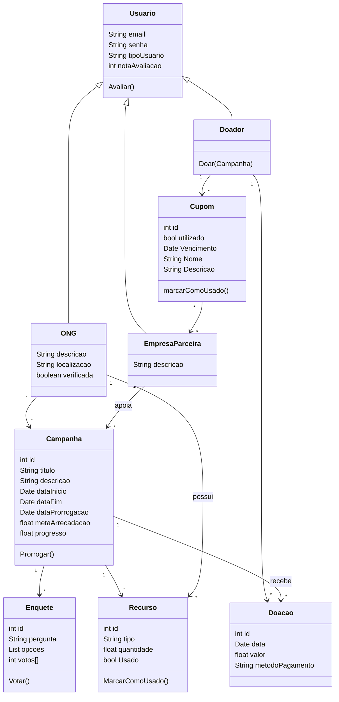

```mermaid
classDiagram
    class Usuario {
        String email
        String senha
        String tipoUsuario
        int notaAvaliacao
        Avaliar()
    }
    class ONG {
        String descricao
        String localizacao
        boolean verificada
    }
    class EmpresaParceira {
        String descricao
    }
    class Cupom {
        int id
        bool utilizado
        Date Vencimento
        String Nome
        String Descricao
        marcarComoUsado()
    }
    class Doador {
        Doar(Campanha)
    }
    class Campanha {
        int id
        String titulo
        String descricao
        Date dataInicio
        Date dataFim
        Date dataProrrogacao
        float metaArrecadacao
        float progresso
        Prorrogar()
    }
    class Enquete {
        int id
        String pergunta
        List<String> opcoes
        int votos[]
        Votar()
    }
    class Recurso {
        int id
        String tipo
        float quantidade
        bool Usado
        MarcarComoUsado()
    }
    class Doacao {
        int id
        Date data
        float valor
        String metodoPagamento
    }
    Usuario <|-- ONG
    Usuario <|-- EmpresaParceira
    Usuario <|-- Doador
    ONG "1" --> "*" Campanha
    EmpresaParceira "1" --> "*" Campanha : apoia
    Campanha "1" --> "*" Enquete
    Campanha "1" --> "*" Recurso
    Doador "1" --> "*" Doacao
    Doador  "1" --> "*" Cupom
    Campanha "1" --> "*" Doacao : recebe
    Cupom "*" --> "*" EmpresaParceira
    ONG "1" --> "*" Recurso : possui

```